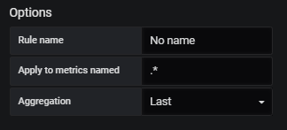

# Mapping and rules
Add a rule by clicking on button "Add Rule", organize your rules order with arrows at left rule header.

## Options
### Rule name
  Enter rule name, for infomation. It display on header rule.

### Apply to metrics 
  Enter alias of metric or regular pattern of metric for this rule, metric are aggregated and values are used to evaluate state.  
  

### Aggregation
  Select aggregation value of series for apply current rule.

  - **min** : The smallest value in the series
  - **max** : The largest value in the series
  - **avg** : The average of all the non-null values in the series
  - **last/current** : The last value in the series. If the series ends on null the previous value will be used.
  - **total** : The sum of all the non-null values in the series
  - **first** : The first value in the series
  - **delta** : The total incremental increase (of a counter) in the series.
  - **diff** : The difference between ‘current’ (last value) and ‘first’.
  - **range** : The difference between ‘min’ and ‘max’. Useful the show the range of change for a gauge.

### Thresholds
  Change the shape and value colors dynamically within the panel.  
  The threshold field accepts 2 comma-separated values which represent 3 ranges that correspond to the three colors directly to the right.  
  For example: if the thresholds are 70, 90 then the first color represents < 70, the second color represents between 70 and 90 and the third color represents > 90.

  - Colors : Select a color and opacity
  - Invert : This link toggles the threshold color order and state (OK, Warning and Error)

## Type
### Number
  Unit and Decimals: Specify unit and decimal precision for numbers.

### String
#### Value/Range to text mapping
  Value/Range to text mapping allows you to translate the value of the summary stat into explicit text. The text will respect all styling, thresholds and customization defined for the value. This can be useful to translate the number of the main shape/text value into a context-specific human-readable word or message.

### Date
  Specify date format. Only available when Type is set to Date.

### Decimals
  Number of decimal to display, only for number type

## Color On
  Select when color is applied :
  - Warning/Critical : If state is OK, Shapes, arrows or text are not colored, keep orginal color.
  - Always : Objects defined in "Shape Mapping" are colored for each state.

## Value On
  Define condition when text/values is displayed.
  - Never : Hide text
  - When metric displayed : Show data if serie not empty.
  - Warning/Critical : Display value instead original selected text if non OK.
  - Critical only : Same, but only if state is critical.

## Update text value
  Define which part of text is replaced vy values.
  - All content : All the text
  - Substring : only a part on string (regex)  
      Example :  
        Original text = "Number of sessions : VALUE".  
        Change "VALUE" with this pattern "/VALUE/" and keep string before.  

## Tooltips
  - As of 0.4.0 : In progress

# Link

## Object as link
  - Add a http link or overwrite on existing for object/shape (defined in link mapping)

## Overwrite link on
Define condition to overwrite or add link

## Url
Enter a valid url to redirect user when he click on shapes.

## Add params to link
Append params of current dashboard to link

# Color Mappings
IN PROGRESS

# Text Mappings
IN PROGRESS

# Link Mappings
IN PROGRESS