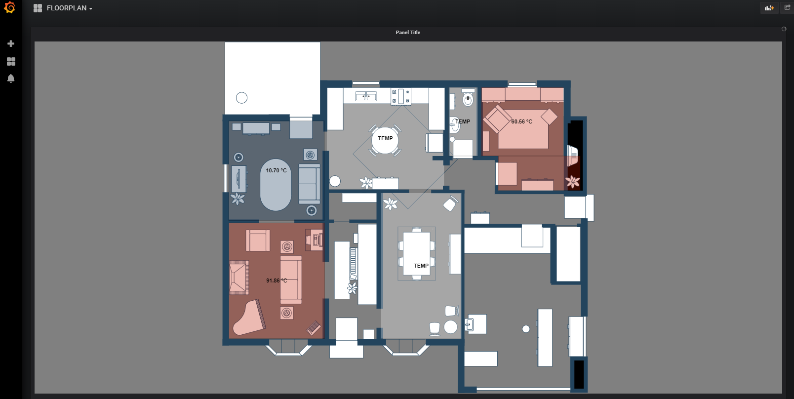

# Tips and tricks

## Examples dashboards with Flowcharting
More examples dashboard at
https://flowcharting.grafana.net

## Zoom into a zone

Double click on empty zone without shape don't work, to zoom on a portion of the graph, we need to create a zone.  
  
Example :  

1. Replace source by value of this [model](https://raw.githubusercontent.com/algenty/flowcharting-repository/master/graphs/ch2_zone.drawio)
2. Open graph in with button "Edit Draw".
3. Create a zone with a rectangle.
4. Resize the zone with the aim that all "A" are in rectangle.
5. Put it to back.
6. In style panel, uncheck "fill" and "line" or keep it visible.
7. Duplicate rectangle : Select rectangle, hold Ctrl and move rectangle on "C".
8. Resize and repeat for the "B".
9.  Click on Save.
10. Double click on zone to test it.

[](images/zoom_zone_ani.png)

## Beautify your graph

In editor or draw.io, use "Shadow" and "Glass" to beautify the graph.
NB : Gradient is not supported at this time in plugin.

[](images/tips_beautify.png)

## Floorplan colorization

In draw.io, use a rectangle to front on the room and reduce opacity to see under the rectangle when color changes.
Uncheck the line if you don't want to see the borderlines.

[](images/floorplan_ani.png)

## Variables
You can use variables in xml définition or url in link.  
Be carreful, at this time, only uncompressed xml supports variables.  
Syntax : ${myVariable}
Supported field with variables :
  - Source Content in flowchart section
  - URL in flowchart section when download source is active
  - Link mapping Url in Mapping section

[](images/variable_link_ani.png)

## Custom variables (version 0.8.0)  
Custom variables and eval are availables on some fields [(see variables section)](./VARIABLES.md).
In supported field, javascript code is supported.
Examples of code :

### Returns a random integer from 1 to 100
```
Math.floor(Math.random() * 100) + 1;
```

### Define a progress bar according the level/value  
1. Add a progress bar in graph by draw.io (Add more shape, Material design, expend GMLD/sliders section)
2. Add 10 colors/intervals
3. Add an event for each level
4. select progress bar in event for what
5. select 'Change position in Bar' for action
6. Enter like below in 'value'
```
${_level} * 10
```
if the value is already between 0-100
Choose like that
```
${_value}
```

[](images/progressbar_ani.png)


Again ? Send me your tips and tricks by email at <grafana.flowcharting@gmail.com>
